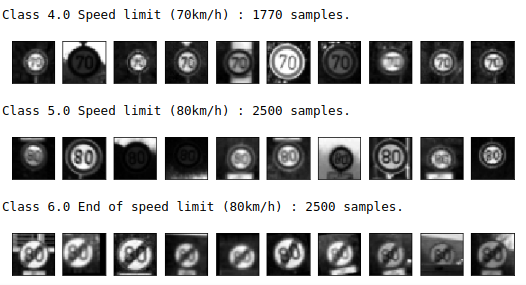
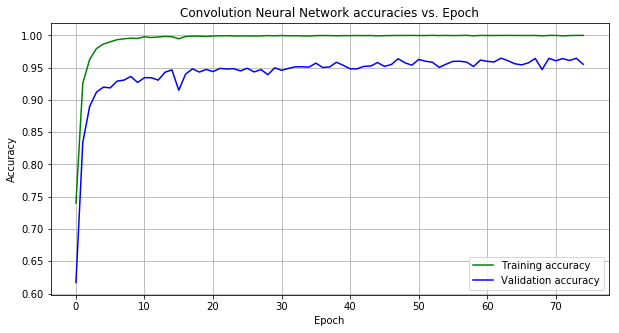
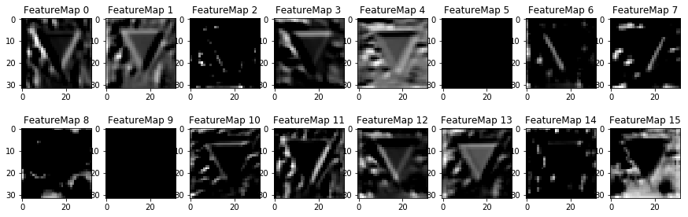

# German Traffic Sign Classification.

The dataset has 43 classes and is severely unbalanced, hence is augmented by random rotations, translations etc, and also added to other invariant classes. They are normalized, grayscaled, and split into train-validation-test sets.

Various architectures were tried out- LeNet5, VGG-16 and a version of Inception which took approximately 300s for an epoch. The final architecture was a relatively simple CNN with tuned hyperparameters of batch size, learning rate and L2-regularization penalty and obtained an test accurhttps://github.com/nsrishankar/german_trafficsign_classification/blob/master/acy of around 97 %. 

An interesting evaluation was the prediction of new images obtained from the Belgian traffic sign dataset- due to the choice of grayscaling values, even though most of the signs had a blue background (as opposed to orange in GTSB) classification was done right. Furthermore, the output feature maps of activation layers is seen below.

 

...However,

